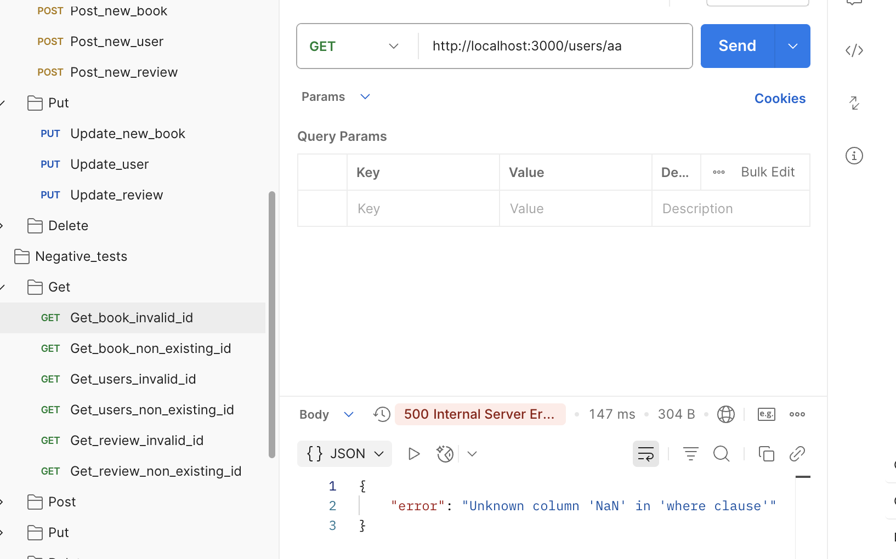

# Bug 1: Get a book by invalid ID

## Description:
When sending a GET request to /books/{id} with an invalid ID (e.g., a string instead of a number), the server returns 500 Internal Server Error instead of a 400 Bad Request.

## Steps to Reproduce:

1. Open Postman.

2. Create a GET request to: http://localhost:3000/books/abc.

3. Send the request.

## Expected Result:

- Status code: 400

- Response: "Invalid ID format"

## Actual Result:

- Status code: 500

- Response: Internal Server Error

**Severity:** Medium

## Screenshot

